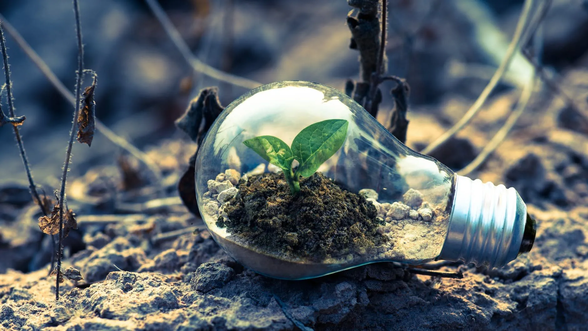

# 1. Impacto ambiental del sector TI  

## **Alto consumo energético de los centros de datos**  
Los centros de datos son infraestructuras esenciales para la tecnología de la información, ya que almacenan y procesan grandes volúmenes de datos. Sin embargo, su funcionamiento requiere un consumo masivo de energía, principalmente para alimentar servidores y sistemas de refrigeración.  

Algunos de los factores que contribuyen a este alto consumo incluyen:  
- **Alta demanda operativa:** Los servidores funcionan las 24 horas del día, los 7 días de la semana.  
- **Refrigeración y climatización:** Para evitar el sobrecalentamiento, los centros de datos dependen de sistemas de enfriamiento intensivos, lo que incrementa aún más el uso de electricidad.  
- **Uso de energías no renovables:** Aunque muchas empresas están migrando hacia fuentes renovables, gran parte de la energía proviene de combustibles fósiles.  

Para mitigar este impacto, diversas compañías han implementado estrategias como la optimización del consumo energético mediante inteligencia artificial, el uso de energías renovables y el diseño de centros de datos más eficientes.  

## **Generación de residuos electrónicos**  
El sector TI es responsable de una gran cantidad de residuos electrónicos, que incluyen dispositivos obsoletos o dañados como computadoras, teléfonos móviles, servidores y otros equipos tecnológicos.  

Los principales problemas asociados con los residuos electrónicos son:  
- **Toxicidad de los materiales:** Muchos dispositivos contienen sustancias peligrosas como plomo, mercurio y cadmio, que pueden contaminar el suelo y el agua si no se gestionan adecuadamente.  
- **Baja tasa de reciclaje:** A nivel global, solo un pequeño porcentaje de los residuos electrónicos se recicla de manera adecuada.  
- **Obsolescencia programada:** Muchos fabricantes diseñan productos con una vida útil limitada, incentivando el reemplazo frecuente y aumentando la cantidad de desechos.  

Para reducir este impacto, se promueve la economía circular a través del reciclaje, la reutilización de componentes y la fabricación de productos con materiales sostenibles. Además, algunos gobiernos han implementado regulaciones para mejorar la gestión de estos residuos.  
